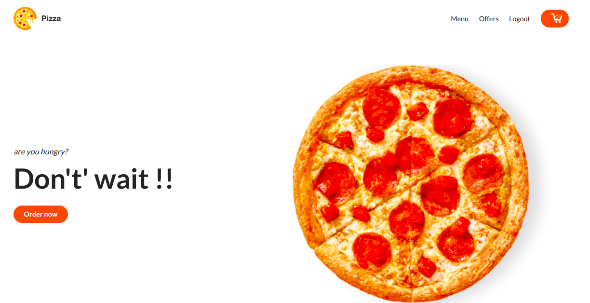
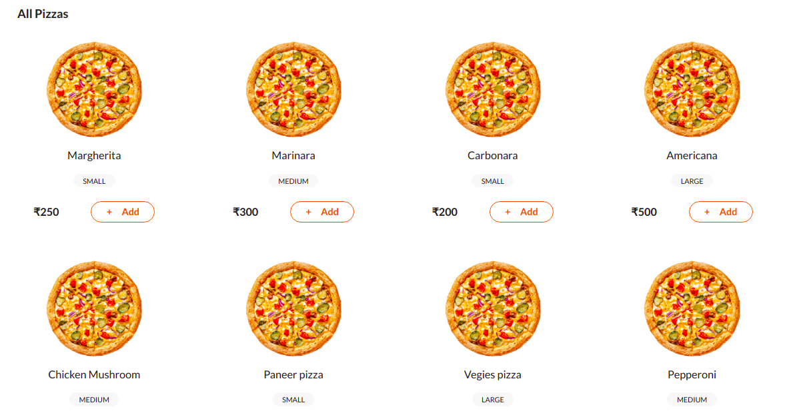

# Building-pizza-order-tracker-app-using-NodeJs-Express-and-Mongo-DB

#



This project was generated with Sass  Nodejs ,ExpressJS , MongoDB & LaravelMix.

### Menus



# Quick Start

### Install Node.js ,Expressjs LaravelMix,and MongoDB:
```sh
$ git clone https://github.com/manish0502/Building-pizza-order-tracker-app-using-NodeJs-Express-and-Mongo-DB.git
$ npm i and  npm run all
$ http://localhost:3000/ 
```
## Development server

Run `npm run server` for a dev server. Navigate to `http://localhost:3000/`. The app will automatically reload if you change any of the source files.


## Tools
```sh
 * SASS , passport-local for authentication ,ejs
 * Nodejs , ExpressJs , Mongo-connect ,SCSS
 * NPM , MongoDB , json-server
 * Animate.css - Animation library, use with ng-animate
 * Moment ,bcrypt
```

## Overall Directory Structure


### What follows is a brief description of each entry, but most directories contain their own README.md file with additional documentation, so browse around to learn more.

 * `NodeJs/ `- Node.js is an open-source, cross-platform, back-end JavaScript runtime environment that runs on the V8 engine and executes JavaScript code outside  a web browser.
 * `LaravelMix/ `- Laravel Mix provides a clean, fluent API for defining basic webpack build steps for your applications. Mix supports several common CSS and JavaScript pre-processors»
 * `ExpressJs/` - Express.js, or simply Express, is a back end web application framework for Node.js *  *`karma/karma`-unit.js to be picked up by the build system.
 * `.bowerrc` - the Bower configuration file. This tells Bower to install components into the vendor/ directory.
 *` bower.json` - this is our project configuration for Bower and it contains the list of Bower dependencies we need.
 * `build.config.js` - our customizable build settings; see "The Build System" below.
 * `module.prefix and module.suffix` - our compiled application script is wrapped in these, which by default are used to place the application inside a self-    
 * `package.json` - metadata about the app, used by NPM and our build script. Our NPM dependencies are listed here.

## Overall Screens Looks as below.

 * Order Summary screen
 
   

 * All Orders screen
 
   
   
 * Login screen
  
  
  
  *Registration
  
  
  
## Code scaffolding

Run `ng generate component component-name` to generate a new component. You can also use `ng generate directive|pipe|service|class|guard|interface|enum|module`.

